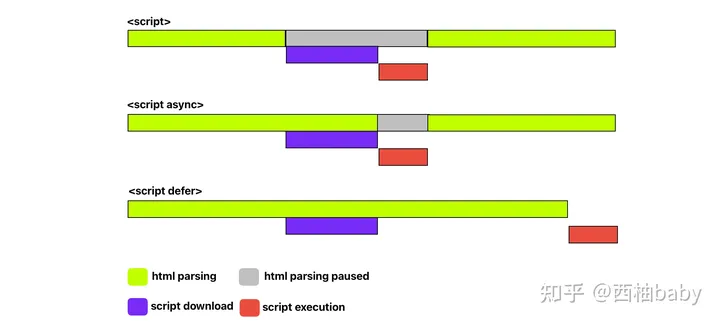

## `src` vs. `href`
`href`是超文本引用，指向网络资源所在位置，建立和当前元素、锚点或者当前文档之间的链接

> 可替换元素: 展现效果不是由CSS来控制、外观的渲染是独立于CSS的元素，例如img、video等

```html
<!-- 网站logo -->
<link rel="icon" type="image/png" href=""> 
<link rel="icon" type="image/x-icon" href=""> 
<link rel="icon" type="image/jpeg" href=""> 
<link rel="icon" type="image/gif" href="">

```


## `title` vs. `alt`

## script标签的`async`和`defer`

> 创建的script标签会默认设置async为true，defer为false



注意:
1. 多个带defer的script标签里js同步执行，而async是异步执行
2. defer会等所有元素解析完成之后，DOMContentLoaded之前执行

